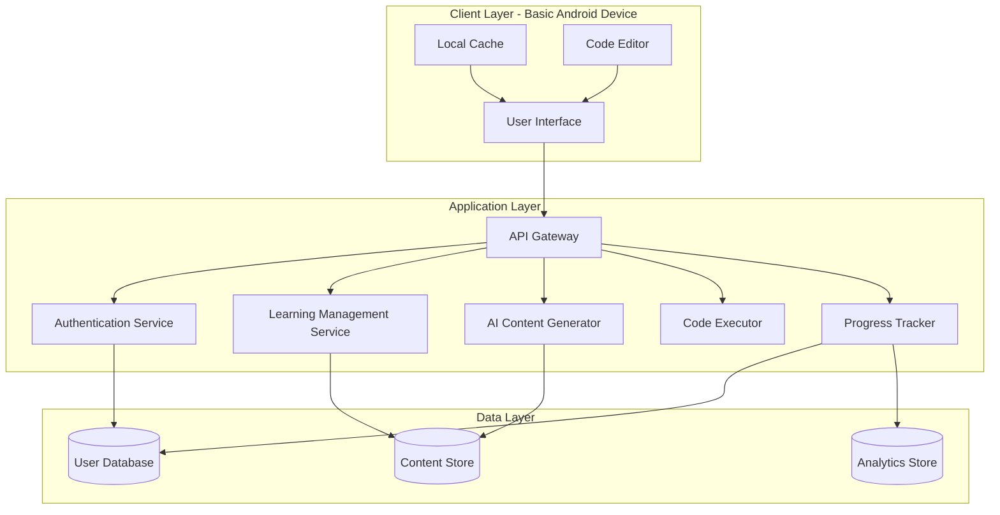
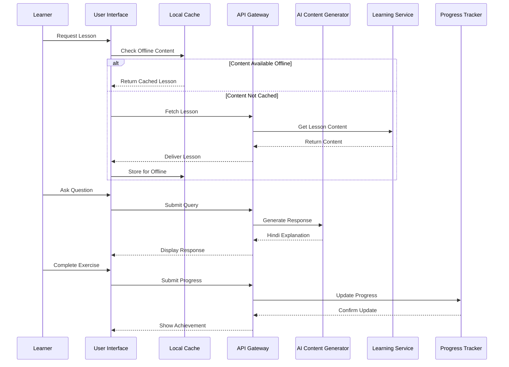

# Design Document: BharatTech Guru

## Overview

BharatTech Guru is an AI-powered educational platform that democratizes technology education for underprivileged children in India. The system combines natural language processing, content generation, and adaptive learning techniques to deliver programming fundamentals instruction in simple Hindi, optimized for low-bandwidth connections and basic devices.

The platform consists of three primary layers:
1. **Presentation Layer**: A lightweight, mobile-optimized interface designed for basic Android devices
2. **Application Layer**: Core learning logic, progress tracking, and AI-powered content generation
3. **Data Layer**: Efficient storage and caching mechanisms optimized for offline capability

The design prioritizes accessibility, affordability, and cultural relevance while maintaining educational effectiveness.

## Architecture

### System Architecture



### Component Interaction Flow



## Components and Interfaces

### 1. User Interface Component

**Responsibility**: Provide a beginner-friendly, Hindi-first interface optimized for basic devices.

**Key Modules**:
- **Home Screen**: Displays current lesson, progress overview, and quick actions
- **Lesson Viewer**: Renders lesson content with Hindi text and code examples
- **Code Editor**: Simple editor with syntax highlighting and run capability
- **Chat Interface**: Conversational interface for asking questions to AI tutor
- **Progress Dashboard**: Visual representation of learning journey

**Interface Design Principles**:
- Maximum 3 primary actions per screen
- Large touch targets (minimum 48x48 pixels)
- High contrast colors for readability in various lighting
- Icons with Hindi labels
- Progressive disclosure of advanced features

**Technical Constraints**:
- Bundle size: Maximum 10 MB
- Memory footprint: Maximum 100 MB RAM during operation
- Minimum Android version: 5.0 (API level 21)
- Screen size support: 4-7 inches

### 2. AI Content Generator

**Responsibility**: Generate contextual, culturally relevant explanations in simple Hindi.

**Core Functions**:
```
function generateExplanation(concept: string, learnerLevel: string, context: string): HindiResponse
  // Uses LLM to create explanation
  // Inputs: programming concept, learner's current level, conversation context
  // Output: Simple Hindi explanation with Indian examples
  
function translateTechnicalTerm(term: string): Translation
  // Returns Hindi translation with English term in parentheses
  // Example: "variable" -> "चर (variable)"
  
function generateExample(concept: string): CodeExample
  // Creates code example with Indian context
  // Includes Hindi comments for each line
  
function adaptComplexity(explanation: string, learnerFeedback: string): HindiResponse
  // Adjusts explanation complexity based on learner's understanding
```

**Example Generation Strategy**:
- Variables: Cricket scores, counting items (rotis, samosas)
- Loops: Daily routines (morning prayers, meal times), festival preparations
- Conditionals: Weather decisions (monsoon), traffic rules
- Functions: Cooking recipes (making chai, dal)
- Arrays: List of students, cricket team players
- Objects: Student information (name, class, marks)

**Language Guidelines**:
- Use commonly spoken Hindi words
- Avoid complex Sanskrit-derived vocabulary
- Provide English technical terms in parentheses
- Use simple sentence structures
- Include encouraging, supportive language

### 3. Learning Management Service

**Responsibility**: Manage curriculum structure, lesson delivery, and content organization.

**Curriculum Structure**:
```
Curriculum:
  - Module 1: Introduction to Programming (प्रोग्रामिंग का परिचय)
    - Lesson 1.1: What is Programming? (प्रोग्रामिंग क्या है?)
    - Lesson 1.2: Variables and Data Types (चर और डेटा प्रकार)
    - Lesson 1.3: Basic Operations (बुनियादी संचालन)
  
  - Module 2: Making Decisions (निर्णय लेना)
    - Lesson 2.1: If-Else Statements (अगर-नहीं तो)
    - Lesson 2.2: Comparison Operators (तुलना संचालक)
    - Lesson 2.3: Logical Operators (तार्किक संचालक)
  
  - Module 3: Repetition (दोहराव)
    - Lesson 3.1: While Loops (जबकि लूप)
    - Lesson 3.2: For Loops (के लिए लूप)
    - Lesson 3.3: Loop Control (लूप नियंत्रण)
  
  - Module 4: Functions (फ़ंक्शन)
    - Lesson 4.1: Creating Functions (फ़ंक्शन बनाना)
    - Lesson 4.2: Parameters and Return Values (पैरामीटर और रिटर्न मान)
    - Lesson 4.3: Function Practice (फ़ंक्शन अभ्यास)
```

**Core Functions**:
```
function getLesson(lessonId: string): Lesson
  // Retrieves lesson content with Hindi text and examples
  
function getNextLesson(currentLessonId: string, learnerProgress: Progress): Lesson
  // Determines next appropriate lesson based on progress
  
function getExercises(lessonId: string): Exercise[]
  // Returns practice exercises for a lesson
  
function validateExercise(exerciseId: string, code: string): ValidationResult
  // Checks if learner's code solution is correct
```

### 4. Progress Tracker

**Responsibility**: Monitor learner advancement, maintain motivation, and sync progress across sessions.

**Data Model**:
```
LearnerProgress:
  - learnerId: string
  - currentModule: number
  - currentLesson: number
  - completedLessons: string[]
  - exercisesCompleted: number
  - consecutiveDays: number
  - lastActiveDate: Date
  - achievements: Achievement[]
  - totalTimeSpent: number (minutes)
  
Achievement:
  - id: string
  - title: string (Hindi)
  - description: string (Hindi)
  - icon: string
  - earnedDate: Date
```

**Core Functions**:
```
function updateProgress(learnerId: string, lessonId: string, completed: boolean): void
  // Records lesson completion
  
function awardAchievement(learnerId: string, achievementType: string): Achievement
  // Awards badge for milestones (first lesson, 7-day streak, etc.)
  
function getProgressSummary(learnerId: string): ProgressSummary
  // Returns overview of learner's journey
  
function syncOfflineProgress(learnerId: string, offlineData: Progress[]): void
  // Syncs progress made while offline
```

**Achievement Types**:
- First Lesson Complete (पहला पाठ पूरा)
- 7-Day Streak (7 दिन की लकीर)
- Module Complete (मॉड्यूल पूरा)
- 10 Exercises Solved (10 अभ्यास हल किए)
- Code Master (कोड मास्टर) - 50 exercises completed

### 5. Code Executor

**Responsibility**: Safely execute learner code and provide immediate feedback.

**Core Functions**:
```
function executeCode(code: string, language: string): ExecutionResult
  // Runs code in sandboxed environment
  // Returns output or error message
  
function validateSyntax(code: string, language: string): SyntaxValidation
  // Checks for syntax errors before execution
  // Returns error location and Hindi explanation
  
function explainError(error: Error, language: string): HindiErrorExplanation
  // Translates technical error messages to simple Hindi
```

**Safety Constraints**:
- Execution timeout: 5 seconds maximum
- Memory limit: 50 MB per execution
- No file system access
- No network access
- Sandboxed environment

**Supported Languages** (Initial Release):
- Python (primary language for teaching)

### 6. Local Cache and Offline Manager

**Responsibility**: Enable offline learning and minimize data usage.

**Core Functions**:
```
function downloadLesson(lessonId: string): Promise<void>
  // Downloads lesson content for offline access
  
function getOfflineLessons(): Lesson[]
  // Returns list of cached lessons
  
function clearCache(olderThan: Date): void
  // Removes old cached content to free space
  
function checkStorageSpace(): StorageInfo
  // Returns available storage information
```

**Caching Strategy**:
- Automatically cache completed lessons
- Allow manual download of upcoming lessons
- Maximum 10 lessons cached at once
- Compress text content (gzip)
- Optimize images (WebP format, max 50 KB each)

### 7. API Gateway

**Responsibility**: Route requests, handle authentication, and optimize data transfer.

**Key Features**:
- Request compression (gzip)
- Response caching
- Rate limiting (prevent abuse)
- Token-based authentication
- Bandwidth optimization

**Endpoints**:
```
GET /api/lessons/:id - Fetch lesson content
GET /api/lessons/:id/exercises - Get practice exercises
POST /api/execute - Run code
POST /api/query - Ask AI tutor
GET /api/progress - Get learner progress
POST /api/progress - Update progress
POST /api/download - Download lesson for offline
```

## Data Models

### Lesson Model
```
Lesson:
  - id: string
  - moduleId: string
  - title: string (Hindi)
  - titleEnglish: string
  - content: string (Hindi markdown)
  - codeExamples: CodeExample[]
  - exercises: Exercise[]
  - estimatedTime: number (minutes)
  - prerequisites: string[] (lesson IDs)
  - difficulty: "beginner" | "intermediate"
  - offlineSize: number (bytes)
```

### CodeExample Model
```
CodeExample:
  - id: string
  - code: string
  - language: string
  - explanation: string (Hindi)
  - output: string
  - editable: boolean
  - hindiComments: string[]
```

### Exercise Model
```
Exercise:
  - id: string
  - lessonId: string
  - question: string (Hindi)
  - starterCode: string
  - solution: string
  - hints: string[] (Hindi)
  - testCases: TestCase[]
  - difficulty: "easy" | "medium" | "hard"
```

### TestCase Model
```
TestCase:
  - input: string
  - expectedOutput: string
  - description: string (Hindi)
```

### Query Model
```
Query:
  - id: string
  - learnerId: string
  - question: string (Hindi)
  - context: string (current lesson, previous queries)
  - timestamp: Date
```

### Response Model
```
Response:
  - id: string
  - queryId: string
  - answer: string (Hindi)
  - examples: CodeExample[]
  - relatedLessons: string[]
  - timestamp: Date
```

## Correctness Properties

*A property is a characteristic or behavior that should hold true across all valid executions of a system—essentially, a formal statement about what the system should do. Properties serve as the bridge between human-readable specifications and machine-verifiable correctness guarantees.*


### Property Reflection

After analyzing all acceptance criteria, I identified several areas of redundancy:

1. **Cultural Examples (2.1-2.4 vs 2.5)**: Requirements 2.1-2.4 specify cultural examples for specific concepts, but 2.5 is a general requirement that subsumes them all. We'll create one comprehensive property for cultural relevance.

2. **Offline Access (3.5 vs 12.1)**: Both test the same behavior - accessing downloaded content offline. We'll combine into one property.

3. **Adaptive Learning (6.4 vs 10.3)**: Both test providing alternative explanations when learners struggle. We'll combine into one property.

4. **Hindi Response (1.1 vs 1.3)**: Both verify responses are in Hindi. We'll combine into one comprehensive property.

5. **Data Optimization (9.4)**: This is covered by specific compression requirements (3.2, 3.3), so no separate property needed.

### Properties

**Property 1: Hindi Language Output**
*For any* learner query or explanation request, the system's response should contain Devanagari script and be in Hindi language.
**Validates: Requirements 1.1, 1.3**

**Property 2: Technical Term Translation Format**
*For any* technical term introduced in an explanation, the output should include both a Hindi translation and the English term in parentheses.
**Validates: Requirements 1.2**

**Property 3: Code Comments in Hindi**
*For any* code example provided by the system, all comments should be in Hindi (Devanagari script).
**Validates: Requirements 1.5**

**Property 4: Cultural Relevance of Examples**
*For any* programming concept explanation, the examples should contain references to Indian culture (keywords related to Indian festivals, food, sports, daily life, or cultural practices).
**Validates: Requirements 2.1, 2.2, 2.3, 2.4, 2.5**

**Property 5: Text Content Compression**
*For any* text content transmitted over the network, it should be compressed (gzip or similar) before transmission.
**Validates: Requirements 3.2**

**Property 6: Image Size Optimization**
*For any* image served by the system, the file size should not exceed 50 KB and should be in an optimized format (WebP or compressed JPEG).
**Validates: Requirements 3.3**

**Property 7: Offline Content Accessibility**
*For any* lesson that has been downloaded, accessing it without an internet connection should return the complete lesson content.
**Validates: Requirements 3.5, 12.1**

**Property 8: Touch Target Minimum Size**
*For any* interactive button or touch element in the UI, the touch target size should be at least 48x48 pixels.
**Validates: Requirements 5.3**

**Property 9: Icon and Label Pairing**
*For any* major function in the UI, both a visual icon and a text label should be present.
**Validates: Requirements 5.4**

**Property 10: Error Feedback in Hindi**
*For any* error condition or learner mistake, the feedback message should be in Hindi and contain encouraging language (positive words like "कोशिश करते रहो", "अच्छा प्रयास", etc.).
**Validates: Requirements 5.5**

**Property 11: Lesson Exercise Association**
*For any* completed lesson, there should exist at least one practice exercise related to that lesson's topic.
**Validates: Requirements 6.2**

**Property 12: Adaptive Explanations on Struggle**
*For any* concept where a learner has failed exercises multiple times (3+ attempts), the system should provide alternative explanations or simpler examples.
**Validates: Requirements 6.4, 10.3**

**Property 13: Code Example Interactivity**
*For any* code example in a lesson, it should be both editable and executable by the learner.
**Validates: Requirements 6.5**

**Property 14: Code Execution Time Limit**
*For any* valid code submitted for execution, the system should return results (output or error) within 3 seconds.
**Validates: Requirements 7.2**

**Property 15: Error Highlighting and Hindi Explanation**
*For any* code containing syntax or runtime errors, the system should highlight the error location and provide an explanation in Hindi.
**Validates: Requirements 7.3**

**Property 16: Code Save and Retrieve Round-Trip**
*For any* code saved by a learner, retrieving it later should return the exact same code content.
**Validates: Requirements 7.4**

**Property 17: Positive Reinforcement on Success**
*For any* correctly completed exercise, the system should provide positive feedback (messages containing words like "बहुत बढ़िया", "शाबाश", "सही है").
**Validates: Requirements 7.5**

**Property 18: Lesson Completion Recording**
*For any* lesson marked as completed by a learner, querying the progress tracker should show that lesson as completed.
**Validates: Requirements 8.1**

**Property 19: Achievement Award on Milestone**
*For any* milestone completion (first lesson, 7-day streak, module completion), the system should award an achievement badge.
**Validates: Requirements 8.2**

**Property 20: Consecutive Days Streak Calculation**
*For any* sequence of learner activity, if the learner practices on N consecutive days, the streak counter should equal N.
**Validates: Requirements 8.4**

**Property 21: AI Response Time Limit**
*For any* question asked to the AI tutor, a response should be provided within 5 seconds.
**Validates: Requirements 10.1**

**Property 22: Complexity Adaptation by Level**
*For any* programming concept, explanations generated for beginner-level learners should use simpler vocabulary and shorter sentences than explanations for intermediate-level learners.
**Validates: Requirements 10.2**

**Property 23: Session Context Retention**
*For any* query within a session, if it references a previous query (using words like "यह", "वह", "इसका"), the response should demonstrate understanding of the previous context.
**Validates: Requirements 10.4**

**Property 24: Encouraging Language in Responses**
*For any* AI-generated response, it should contain at least one encouraging or supportive phrase.
**Validates: Requirements 10.5**

**Property 25: Content Safety Filtering**
*For any* generated response, it should not contain inappropriate language (profanity, violence, adult content).
**Validates: Requirements 11.1**

**Property 26: External Link Whitelisting**
*For any* external link provided by the system, it should be from an approved whitelist of educational domains.
**Validates: Requirements 11.3**

**Property 27: Offline Status Indication**
*For any* lesson, the UI should correctly indicate whether it is available offline or requires internet connection.
**Validates: Requirements 12.2**

**Property 28: Offline Progress Synchronization**
*For any* progress made while offline, when internet connection is restored, syncing should result in the cloud database reflecting all offline changes.
**Validates: Requirements 12.3**

## Error Handling

### Error Categories and Handling Strategies

**1. Network Errors**
- **Scenario**: No internet connection, slow connection, timeout
- **Handling**: 
  - Display friendly Hindi message: "इंटरनेट कनेक्शन नहीं है। कृपया बाद में कोशिश करें।"
  - Automatically switch to offline mode if content is cached
  - Queue progress updates for later sync
  - Retry failed requests with exponential backoff

**2. Code Execution Errors**
- **Scenario**: Syntax errors, runtime errors, infinite loops
- **Handling**:
  - Highlight error line in code editor
  - Provide Hindi explanation of error type
  - Suggest common fixes in simple language
  - Timeout infinite loops after 5 seconds
  - Example: "लाइन 3 में गलती है। आपने 'print' की स्पेलिंग गलत लिखी है।"

**3. Storage Errors**
- **Scenario**: Insufficient storage space, cache corruption
- **Handling**:
  - Check available storage before downloads
  - Warn user in Hindi: "आपके फोन में जगह कम है। कृपया कुछ फाइलें हटाएं।"
  - Offer to clear old cached lessons
  - Gracefully handle corrupted cache by re-downloading

**4. Authentication Errors**
- **Scenario**: Invalid credentials, expired session
- **Handling**:
  - Clear error messages in Hindi
  - Automatic session refresh when possible
  - Preserve unsaved work during re-authentication
  - Fallback to guest mode for basic access

**5. AI Generation Errors**
- **Scenario**: AI service unavailable, inappropriate content generated
- **Handling**:
  - Fallback to pre-written explanations for common topics
  - Filter and regenerate if inappropriate content detected
  - Display: "माफ़ करें, मैं अभी जवाब नहीं दे सकता। कृपया बाद में कोशिश करें।"
  - Log errors for system improvement

**6. Input Validation Errors**
- **Scenario**: Invalid user input, malformed data
- **Handling**:
  - Validate input before processing
  - Provide specific, actionable feedback in Hindi
  - Highlight invalid fields
  - Prevent submission until corrected

### Error Recovery Mechanisms

**Automatic Recovery**:
- Retry failed network requests (max 3 attempts)
- Auto-save learner progress every 30 seconds
- Restore session state after app crash
- Sync offline data when connection restored

**User-Initiated Recovery**:
- "पुनः प्रयास करें" (Retry) button for failed operations
- Manual sync option for offline progress
- Clear cache option in settings
- Report problem feature with pre-filled context

## Testing Strategy

### Dual Testing Approach

The BharatTech Guru platform requires both unit testing and property-based testing to ensure comprehensive coverage and correctness.

**Unit Tests**: Focus on specific examples, edge cases, and integration points
- Specific lesson content rendering
- UI component behavior on different screen sizes
- Error message formatting
- Achievement badge display logic
- Offline/online mode transitions

**Property-Based Tests**: Verify universal properties across all inputs
- All properties defined in the Correctness Properties section
- Use randomized inputs to test general correctness
- Minimum 100 iterations per property test

### Property-Based Testing Configuration

**Library Selection**:
- **For Python backend**: Use `hypothesis` library
- **For JavaScript/TypeScript frontend**: Use `fast-check` library

**Test Configuration**:
```python
# Python example using hypothesis
from hypothesis import given, settings
import hypothesis.strategies as st

@settings(max_examples=100)
@given(query=st.text(min_size=1))
def test_hindi_response_property(query):
    """
    Feature: bharattech-guru, Property 1: Hindi Language Output
    For any learner query, the system's response should contain Devanagari script
    """
    response = content_generator.generate_explanation(query)
    assert contains_devanagari(response.text)
    assert is_hindi_language(response.text)
```

```typescript
// TypeScript example using fast-check
import fc from 'fast-check';

describe('BharatTech Guru Properties', () => {
  it('Property 1: Hindi Language Output', () => {
    fc.assert(
      fc.property(fc.string({ minLength: 1 }), (query) => {
        // Feature: bharattech-guru, Property 1: Hindi Language Output
        const response = contentGenerator.generateExplanation(query);
        expect(containsDevanagari(response.text)).toBe(true);
        expect(isHindiLanguage(response.text)).toBe(true);
      }),
      { numRuns: 100 }
    );
  });
});
```

**Test Tagging Requirements**:
- Each property test MUST include a comment referencing the design property
- Format: `Feature: bharattech-guru, Property {number}: {property_title}`
- This ensures traceability between design and implementation

### Testing Priorities

**Critical Path Testing** (Must have 100% coverage):
1. Hindi language output (Properties 1, 3, 10, 15)
2. Content safety and filtering (Property 25)
3. Code execution and error handling (Properties 14, 15)
4. Progress tracking and persistence (Properties 18, 28)
5. Offline functionality (Properties 7, 27, 28)

**High Priority Testing** (Target 90% coverage):
1. Cultural relevance (Property 4)
2. UI accessibility (Properties 8, 9)
3. AI response quality (Properties 21-24)
4. Data optimization (Properties 5, 6)

**Medium Priority Testing** (Target 70% coverage):
1. Achievement system (Property 19)
2. Exercise validation (Properties 11, 17)
3. Adaptive learning (Property 12)

### Integration Testing

**End-to-End Scenarios**:
1. Complete learner journey: Registration → First lesson → Exercise → Progress tracking
2. Offline workflow: Download lesson → Go offline → Complete lesson → Sync progress
3. AI interaction: Ask question → Receive explanation → Ask follow-up → Verify context retention
4. Error recovery: Trigger network error → Verify offline mode → Restore connection → Verify sync

**Performance Testing**:
1. Lesson load time on simulated 256 Kbps connection
2. Code execution time for various code samples
3. AI response time under load
4. Memory usage on low-end devices (1 GB RAM)
5. Battery consumption during 30-minute session

**Compatibility Testing**:
1. Android versions: 5.0, 6.0, 7.0, 8.0, 9.0, 10+
2. Screen sizes: 4", 5", 6", 7"
3. Network conditions: 2G, 3G, 4G, WiFi, Offline
4. Device specifications: Low-end (1GB RAM), Mid-range (2-3GB RAM)

### Manual Testing Requirements

**Usability Testing with Target Users**:
- Test with actual children from target demographic
- Observe navigation patterns and confusion points
- Gather feedback on Hindi language clarity
- Assess cultural relevance of examples
- Measure engagement and motivation levels

**Accessibility Testing**:
- Test with users who have limited technology experience
- Verify touch targets are easy to tap
- Ensure text is readable in various lighting conditions
- Confirm icons are intuitive without labels

**Content Quality Review**:
- Expert review of Hindi translations
- Pedagogical review of lesson progression
- Cultural sensitivity review of examples
- Age-appropriateness verification

### Continuous Testing

**Automated Test Execution**:
- Run unit tests on every code commit
- Run property tests nightly (due to longer execution time)
- Run integration tests before each release
- Monitor test coverage and maintain minimum thresholds

**Production Monitoring**:
- Track error rates and types
- Monitor AI response quality and appropriateness
- Measure actual performance metrics (load times, execution times)
- Collect user feedback and bug reports
- A/B test different explanation styles and examples

### Test Data Strategy

**Synthetic Data Generation**:
- Generate diverse learner profiles (different levels, progress states)
- Create varied programming queries in Hindi
- Generate edge cases (very long code, special characters, etc.)
- Simulate network conditions and device constraints

**Real Data Usage** (with privacy protection):
- Anonymized learner queries for AI testing
- Actual error patterns for error handling improvement
- Real performance metrics from production
- User feedback for content quality assessment
